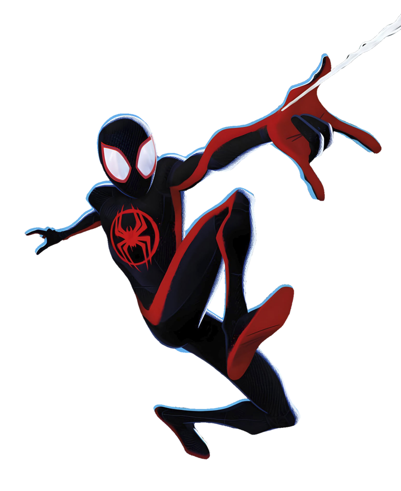

# 🕸️ Spider-Man Multiverse

Bem-vindo à Landing Page dos Spiders! Este projeto foi inicialmente desenvolvido em uma sessão de coding com a professora Michele Ambrosio, e posteriormente incrementado com novas funcionalidades e melhorias.

🎮 **Tecnologias Utilizadas**

- **HTML5 e CSS3**: Para a estrutura e apresentação da aplicação.
- **JavaScript**: Para a lógica de programação e interatividade.
- **Fontes**: Utilização de fontes personalizadas para aprimorar a estética da página.
  

🕹️ **Funcionalidades Incríveis**

- **Design Responsivo**: A página se adapta a diferentes tamanhos de tela, garantindo uma experiência agradável em dispositivos móveis e desktop.
- **Animações**: Elementos da página possuem animações para criar uma interação dinâmica e envolvente.
- **Efeitos de Hover**: Ao passar o mouse sobre certos elementos, animações e efeitos visuais são ativados, proporcionando uma experiência visual rica.

🆙 **Incrementações**

Durante a sessão de coding de hoje, foram adicionadas as seguintes incrementações ao projeto:

- Adição de música de fundo para cada um dos spiders, criando uma atmosfera mais imersiva e personalizada para cada personagem.
- Adição de um novo spider, Miles Morales, que se junta à equipe de heróis da página.

🚀 **Como Visualizar**

1. Clone este repositório para sua máquina local usando o comando:
   
bash
   git clone https://github.com/debrulima/spiderman-multiverse.git

2. Abra o arquivo index.html no seu navegador web.

3. Ou acesse pelo site: https://debrulima.github.io/spiderman-multiverse/

4. Explore a página, interagindo com os elementos e aproveitando as animações e efeitos.

💻 **Contribuições** 

Contribuições são sempre bem-vindas! Se você deseja melhorar a landing page, adicionar novos recursos ou corrigir problemas, sinta-se à vontade para abrir um pull request.

👏 **Créditos**

Agradeço à professora Michele Ambrosio por ter desenvolvido o projeto inicial e por ter me guiado durante a sessão de coding. Sem sua ajuda e orientação, este projeto não teria sido possível.